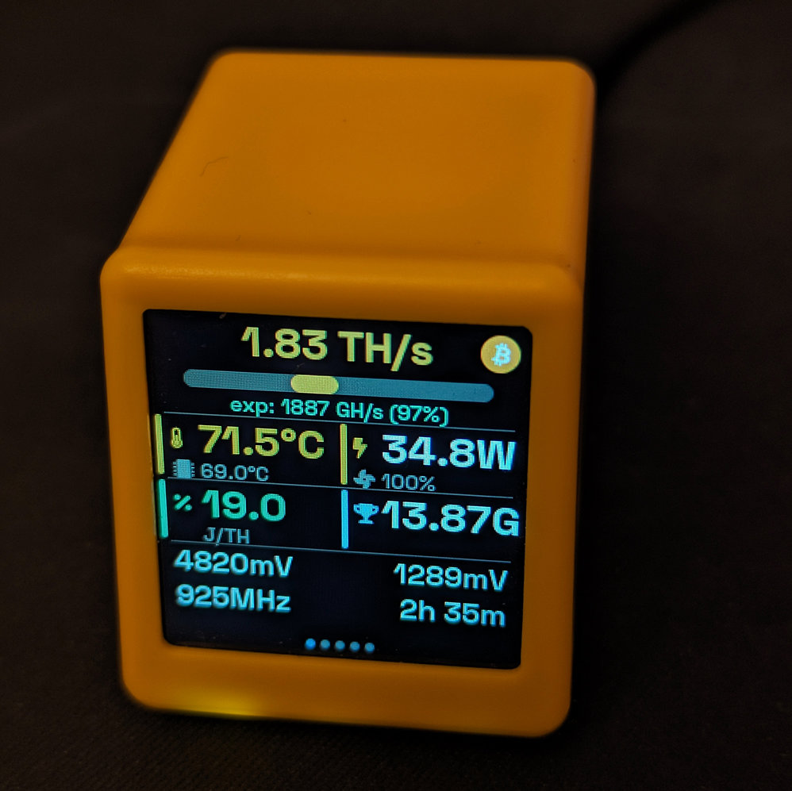

# BitAxe Dashboard for NM-TV-154

> **Your BitAxe deserves a dedicated display.**

The [BitAxe](https://github.com/skot/bitaxe) is the world's first fully open-source
Bitcoin ASIC miner — a tiny device that solo-mines BTC at 500 GH/s to 3+ TH/s,
drawing just 12–30 W from a USB-C plug. It won't compete with warehouse-scale
mining farms, but that was never the point. BitAxe is about sovereignty,
decentralization, and the thrill of lottery mining: for a few dollars a month
in electricity, you hold a ticket to the next ~$200 K+ block reward.
And yes — [solo BitAxe miners have already found multiple blocks](https://www.solosatoshi.com/has-bitaxe-found-a-block-next-block-is-closer-than-you-think/).

**So what do you stare at while the lottery runs 24/7?**

This project turns the **NM-TV-154** — a $6 ESP32 cube with a 1.54" IPS display —
into a dedicated, always-on mining dashboard for your BitAxe.
Five info-packed screens, live-updating every 5 seconds, navigable with a single
touch. Hashrate, temperatures, shares, pool info, network stats — all at a glance,
no browser tabs needed. And if you ever hit a block, a full-screen blinking alert
makes sure you won't miss the moment.

| | BitAxe miner | This dashboard |
|---|---|---|
| **Does** | Solo-mines Bitcoin (lottery-style) | Shows live mining stats |
| **Power** | 12–30 W | ~0.8 W |
| **Cost** | $50–200 | ~$6 |
| **Together** | The perfect open-source solo mining setup on your desk |



---

## Features

- **Five dashboard screens** — touch button cycles through them with slide animations and page-dot indicators:
  1. **Main** — hashrate (GH/s or TH/s) with color-coded bar, best difficulty, shares
  2. **Performance** — detailed hashrate stats, power, efficiency
  3. **Thermal** — ASIC + VR temperatures (°C), fan speed, voltage, red warnings
  4. **Mining** — accepted/rejected shares, best difficulty (K/M/G/T), pool info
  5. **Network** — stratum URL, worker name, WiFi signal, hostname, uptime, IP, firmware
- **Block found overlay** — full-screen blinking alert when a new block is found, dismissable by touch
- **Auto-refresh** — configurable poll interval (default 5 s)
- **Connecting splash** — animated spinner while waiting for WiFi / first API response
- **Captive portal setup** — on first boot (or after reset), device opens a WiFi AP with a web form to configure credentials without recompiling
- **Config reset** — hold touch button for 3 s at boot to wipe NVS and re-enter setup mode

---

## Hardware

| Parameter | Value |
|-----------|-------|
| Device | NM-TV-154 (yellow cube, ESP32-WROOM-32) |
| Display | 1.54" IPS TFT, ST7789, 240x240, SPI @ 40 MHz |
| Input | Capacitive touch button (top) |
| Power | 5 V USB-C, ~0.8 W |
| WiFi | 802.11 b/g/n |
| Flash | 4 MB |

---

## Configuration

### First-time setup (captive portal)

On first boot, or after a config reset, the device starts a WiFi access point named
`Bitaxe-Dashboard-Setup` (open, no password). Connect to it from any phone or computer,
then open `http://192.168.4.1/` (most devices redirect automatically). Fill in:

| Field | Description |
|-------|-------------|
| WiFi SSID | Your home/office network name |
| WiFi Password | Network password (leave blank if open) |
| Miner IP Address | IP of the BitAxe (e.g. `192.168.1.50`) |

Save and the device restarts, connects to your WiFi, and shows the dashboard.

### Kconfig defaults (optional / fallback)

Compile-time defaults can still be set via `idf.py menuconfig` under **"BitAxe Dashboard"**.
They apply only if the NVS has no saved config:

| Option | Default | Description |
|--------|---------|-------------|
| WiFi SSID | `your-ssid` | Network to connect to |
| WiFi Password | *(empty)* | Network password |
| BitAxe IP Address | `10.5.0.6` | IP of the BitAxe miner |
| API poll interval | 5000 ms | How often to fetch data (2000–60000 ms) |
| Backlight brightness | 80 % | Display brightness (0–100 %) |

Touch pad channel is configurable under **"NM-TV-154 Configuration"** (default: T9 / GPIO 32).

### Resetting the config

Hold the touch button for 3 s during boot. A countdown is shown on-screen. Release early to cancel.
After confirmation the NVS is erased and the device reboots into captive portal mode.

---

## Quick Flash (pre-built firmware)

If you just want to flash the dashboard without setting up the full ESP-IDF toolchain:

### Prerequisites

- USB cable connected to the NM-TV-154 (CH340 serial)
- **Windows:** install the [CH340 driver](https://www.wch-ic.com/downloads/CH341SER_EXE.html) if the device is not recognized
- **Linux:** `sudo usermod -aG dialout $USER` for serial port access

### Option A — Command line (Linux / macOS / Windows)

Install `esptool`: `pip install esptool`

```bash
# Linux
esptool.py --chip esp32 -p /dev/ttyUSB0 -b 460800 \
  --before default_reset --after hard_reset \
  write_flash --flash_mode dio --flash_size 4MB --flash_freq 40m \
  0x0 firmware/bitaxe-dashboard-full.bin

# macOS — port is typically /dev/cu.usbserial-*
# Windows — replace -p with the correct COM port, e.g. -p COM3
```

### Option B — ESP Flash Download Tool (Windows GUI)

1. Download [Flash Download Tool](https://www.espressif.com/en/support/download/other-tools) from Espressif
2. Run the tool, select **ESP32** and **Develop** mode
3. Add the binary: `firmware/bitaxe-dashboard-full.bin` at address **0x0**
4. Set: SPI Speed **40 MHz**, SPI Mode **DIO**, Flash Size **4 MB**
5. Select the correct **COM port** and click **START**

After flashing, the device boots into the captive portal for first-time setup
(see [Configuration](#configuration) above).

---

## Build & Flash (from source)

### Prerequisites

- ESP-IDF v5.5.x (tested with v5.5.3)
- USB cable connected to the NM-TV-154 (CH340 serial)
- Linux: `sudo usermod -aG dialout $USER` for serial port access

### Commands

```bash
# 1. Source ESP-IDF environment
source ~/.espressif/v5.5.3/esp-idf/export.sh

# 2. Set target
idf.py set-target esp32

# 3. (Optional) Set compile-time defaults
idf.py menuconfig
# → "BitAxe Dashboard" → set fallback SSID, password, miner IP

# 4. Build
idf.py build

# 5. Flash and monitor
idf.py -p /dev/ttyUSB0 flash monitor
# Exit monitor: Ctrl+]
```

WiFi credentials and miner IP are normally configured at runtime via the captive portal
(see Configuration above) and do not require a reflash.

---

## How It Works

1. Display and backlight initialize (SPI + ST7789 + LVGL)
2. Splash screen appears
3. NVS and common WiFi subsystem initialize
4. Config loads from NVS (falls back to Kconfig if unconfigured)
5. Boot reset check: if touch is held for 3 s, NVS is erased and device reboots
6. If no config is saved, captive portal starts (WiFi AP + DNS redirect + HTTP form)
7. Otherwise WiFi connects in STA mode with NVS credentials (auto-reconnect on disconnect)
8. Background task polls `http://<miner IP>/api/system/info` every 5 s
9. JSON response is parsed into a `bitaxe_data_t` struct
10. LVGL UI updates with fresh data (thread-safe via display lock)
11. Touch button cycles between the five dashboard screens

---

## Troubleshooting

| Symptom | Cause | Fix |
|---------|-------|-----|
| "Connecting..." stays forever | Wrong WiFi credentials | Reboot + hold touch 3 s to reset config, then use captive portal |
| Screen shows error after connecting | BitAxe unreachable | Verify miner IP via portal reset; ensure both devices are on the same network |
| Setup portal does not appear | Config was already saved | Hold touch 3 s at boot to reset NVS |
| Browser does not auto-redirect in AP mode | Device-specific captive portal detection | Navigate manually to `http://192.168.4.1/` |
| No data / all zeros | BitAxe API changed or miner is off | Check `http://<IP>/api/system/info` in a browser |
| Screen black | Display power not enabled | Check that GPIO 21 (power) and GPIO 19 (backlight) are both driven LOW |
| Colors wrong | Missing color inversion | Ensure `esp_lcd_panel_invert_color(true)` in display init |
| Touch not working | Threshold needs tuning | Check serial log for baseline value; adjust in `board_config.h` |

---

## References

- [BitAxe GitHub](https://github.com/skot/bitaxe)
- [NMMiner Product Page](https://www.nmminer.com/product/nm-tv-154/)
- [ESP-IDF Documentation](https://docs.espressif.com/projects/esp-idf/en/latest/esp32/)
- [LVGL 9.2 Documentation](https://docs.lvgl.io/9.2/)
